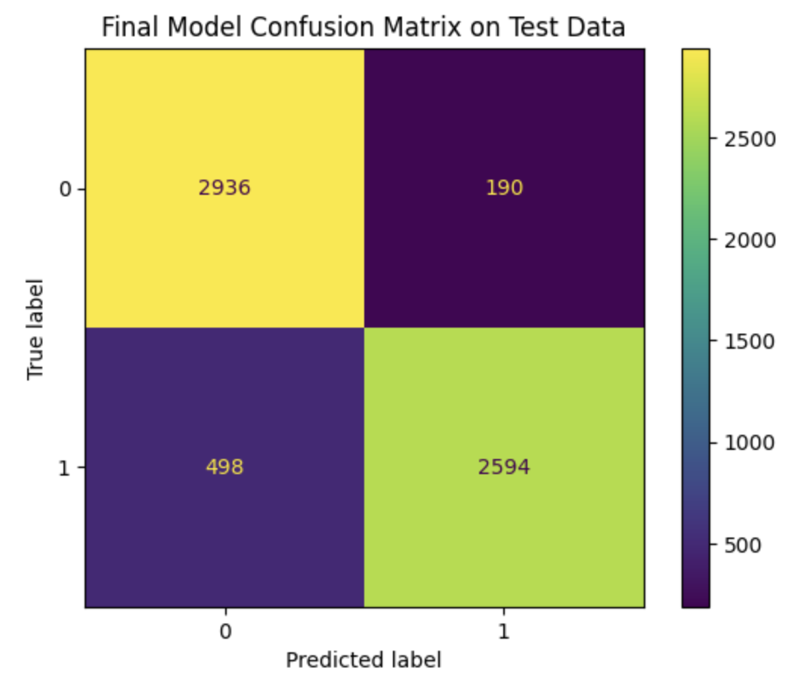

*An exploratory analysis of the dataset can be accessed [here](https://jsimpauco.github.io/LoLSupportsVsJunglers/).*

# Problem Identification

With the dataset containing statistics from professional League of Legends games played in 2022, the following question is proposed: Given a team’s stats after a single competitive game, can we predict if the team won (or lost) the match? 

This type of prediction problem is a binary classification problem with the outcomes being a win (represented as 1 in the dataset) or a loss (0 otherwise). The ‘result’ is the response variable in this proposal. It was chosen because players care the most about winning/losing a game, and thus was a higher priority to predict. The metric that will be used to evaluate the model will be accuracy score. Accuracy score was chosen over F1-score since there are no class imbalances and both false positives and false negatives are equally bad for the model. The features used will be statistics that will be known at the end of the game, meaning that the time of prediction will allow for most of the data from the dataset to be used.

# Baseline Model

The model chosen was a DecisionTreeClassifier with the only hyperparameter being the max_depth set to 2. The features of the model are as follows:
- ‘side’: The side at which a team played on. There are two sides in League of Legends - Blue and Red,
- ‘kills’: The total amount of kills the team finished with at the end of the match,
- ‘deaths’: The total number of deaths the team finished with at the end of the match,
- ‘assists’: The total amount of assists the team gathered during the match,
- ‘dragons’: The total number of dragons killed by the team,
- ‘barons’: The total number of barons killed by the team, and
- ‘visionscore’: The collective sum of all 5 players visionscore.

|   side |   kills |   deaths |   assists |   dragons |   barons |   visionscore |   result |
|-------:|--------:|---------:|----------:|----------:|---------:|--------------:|---------:|
|      1 |       9 |       19 |        19 |         1 |        0 |           197 |        0 |
|      0 |      19 |        9 |        62 |         3 |        0 |           205 |        1 |
|      1 |       3 |       16 |         7 |         1 |        0 |           277 |        0 |
|      0 |      16 |        3 |        39 |         4 |        2 |           346 |        1 |
|      1 |      13 |        6 |        35 |         2 |        1 |           162 |        1 |

There is 1 nominal feature (‘side’) and 6 quantitative features (‘kills’, ‘deaths’, ‘assists’, ‘dragons’, ‘barons’, ‘visionscore’). The quantitative columns were left mostly alone with the main change being the data types to their appropriate encodings. The ‘side’ feature was one-hot encoded with ‘Blue’ represented as 1 and ‘Red’ represented as 0.

**ADD MODEL PERFORMANCE**

# Final Model

While creating the final model, four new features were added. Three of them consisted of using the RobustScaler from sklearn on ‘kills’, ‘deaths’, and ‘barons’. The reasoning for this was when drawn on a histogram, the distributions for each feature were all positively skewed. Also, when looking at the relation between the features and ‘result’, there was an obvious difference between the distributions.

<iframe src="assets/kills-hist.html" width=650 height=450 frameBorder=0></iframe>

The RobustScaler was used to remedy this to ensure that extreme numbers are not automatically seen as a certain result. RobustScaler was used instead of StandardScaler to account for outliers since RobustScaler uses median and interquartile range within its calculations in comparison to the mean and standard deviation which are both affected by outliers.

The last new feature that was created was using the KBinsDiscretizer from sklearn on ‘visionscore’. The reasoning behind this was when drawn on a histogram, ‘visionscore’ was roughly normally distributed but had a lot of outliers.

<iframe src="assets/visionscore-hist.html" width=650 height=450 frameBorder=0></iframe>

KBinsDiscretizer was used to solve this problem by binning the data into categories so that outliers weigh the same as any other data point.

The model chosen was still the DecisionTreeClassifier. To find the best hyperparameters, GridSearchCV was used with the cross-validation being set to 5. The following hyperparameters were explored:
- max_depth: To find how tall the tree should be in order to make a classification,
- min_samples_split: To find the minimum number of samples to split a node so that classifications are not made with a certain amount of data,
- criterion: To find the best criterion to split a node, and
- splitter: To find how to best split the features to split a node.

**ADD MODEL PERFORMANCE AND HYPERPARAMETERS**

# Fairness Analysis

For the fairness analysis, the two groups were as follows:
- “single digit kills”, where the number of kills is under 10, and
- “double digit kills”, where the number of kills is greater than or equal to 10

**Null Hypothesis**: Our model is fair. Its accuracy for single digit and double digit kills are roughly similar with any differences due to random chance.

**Alternative Hypothesis**: Our model is unfair. Its accuracy for single digit kills is higher than its accuracy for double digit kills.

With the test statistic being accuracy score, the significance level is set at 0.05.

<iframe src="assets/perm-fig.html" width=650 height=450 frameBorder=0></iframe>

The resulting p-value is 0.0 and thus the null hypothesis is rejected. Based on these results, we can infer that the model can be more accurate towards data that contains single digits in kills. This is probably caused by the lower kill counts usually resulting in losses. In contrast, some of the mid-range kill counts can be classified as either a loss or a win. This mid-range may cause the model to be inaccurate, resulting in the calculated p-value.
